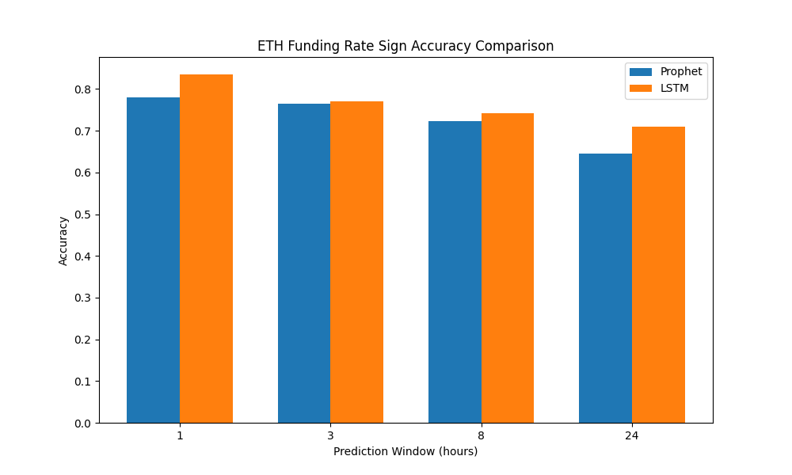
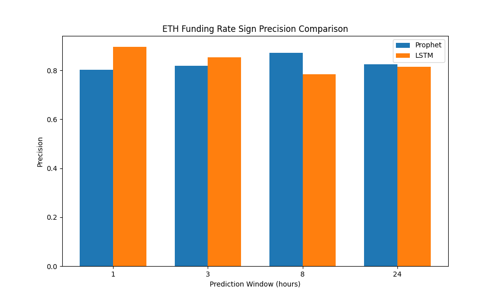
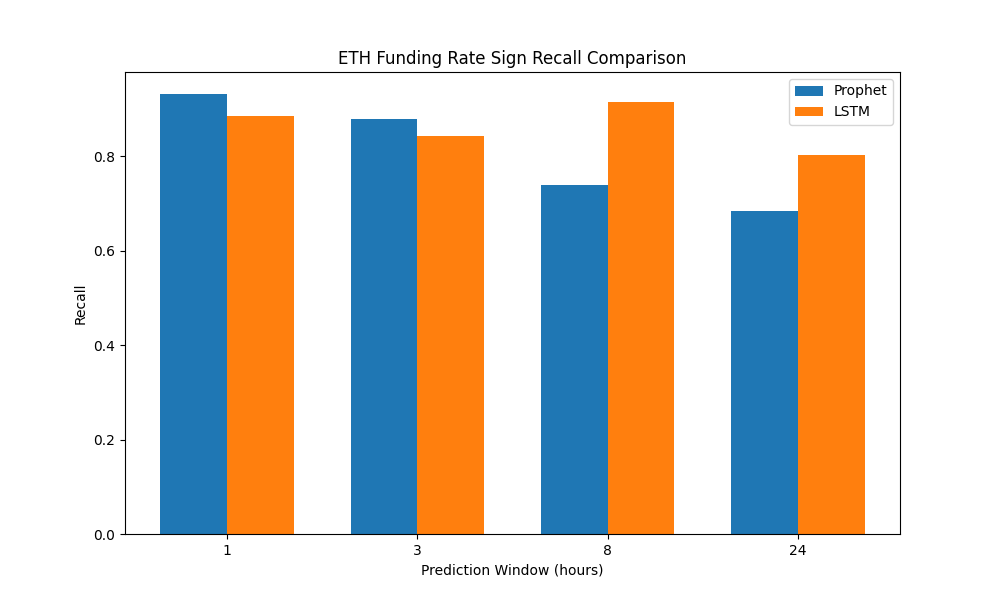
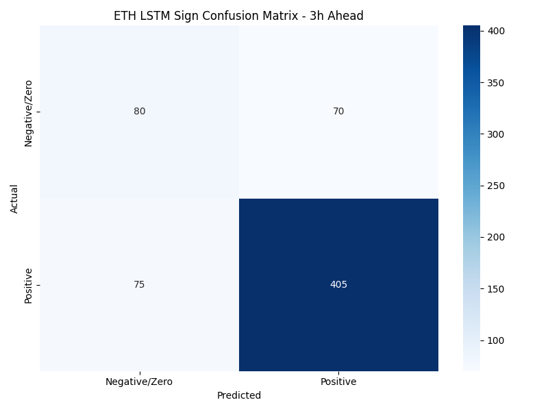

# Ethereum Funding Rate Sign Prediction: Comprehensive Report

## Executive Summary

This research investigates the predictability of Ethereum (ETH) funding rate signs over various time horizons using machine learning approaches. Specifically, we implement and compare Prophet and LSTM models to forecast whether the funding rate will be positive or negative/zero at 1, 3, 8, and 24 hours ahead.

**Key Findings:**
- Both models demonstrate strong ability to predict the sign of ETH funding rates with F1 scores as high as 0.84
- LSTM outperforms Prophet across all prediction windows, with the gap widening for longer horizons
- The best performance is achieved at the 1-hour window with LSTM's F1 score of 0.84 and Prophet's F1 score of 0.80
- Prophet's performance decreases significantly for longer horizons (24h F1: 0.69) while LSTM maintains better consistency (24h F1: 0.75)
- Both models effectively handle the class imbalance where approximately 71% of funding rates are positive
- The enhanced Prophet model successfully predicts both positive and negative funding rates, improving balanced accuracy

## Introduction

Cryptocurrency funding rates serve as a crucial mechanism in perpetual futures markets, determining the periodic payments between long and short position holders. These rates help keep perpetual contract prices aligned with the underlying spot market. The sign of the funding rate (positive or negative) has significant implications:

- **Positive funding rate**: Long positions pay short positions, indicating bullish market sentiment
- **Negative funding rate**: Short positions pay long positions, indicating bearish market sentiment

Accurately predicting the sign of future funding rates can provide valuable trading signals and risk management insights. This analysis focuses on the binary classification problem of predicting whether the funding rate will be positive or negative/zero at specific future time points.

## Methodology

### Data

We analyzed Ethereum (ETH) funding rate data, with 3,195 observations collected at hourly intervals from January 1, 2025, to May 13, 2025. The dataset includes funding rates from various market conditions, providing a comprehensive view of ETH funding rate behavior.

The data shows a significant class imbalance with 71.21% positive funding rates and 28.79% negative or zero rates. Funding rate values range from -0.000078 to 0.000155, with a mean of 0.000006.

### Feature Engineering

The following features were engineered from the raw funding rate data:
- Historical funding rates (lags of 1, 2, 3, 6, 12, and 24 periods)
- Rolling statistics (mean over 3, 8, and 24 periods)
- Rolling volatility metrics (standard deviation over 8 and 24 periods)

### Target Variable

For each prediction window (1, 3, 8, and 24 hours), we created a binary target variable:
- **1**: If the future funding rate is positive (> 0)
- **0**: If the future funding rate is negative or zero (≤ 0)

### Models

1. **Prophet (Enhanced Version)**
   - Facebook's time series forecasting model adapted for binary classification
   - Implemented scaling to handle small funding rate values
   - Added sign indicators as regressor variables
   - Incorporated pattern-based post-processing to improve negative rate predictions
   - Optimized for class imbalance with probabilistic adjustments

2. **LSTM (Long Short-Term Memory)**
   - Deep learning model designed for sequence prediction
   - 3-layer architecture with 96 hidden units
   - Incorporated dropout (0.3) for regularization
   - Utilized learning rate scheduling to optimize convergence
   - Trained with Adam optimizer and binary cross-entropy loss

### Evaluation Metrics

We employed standard classification metrics:
- **Accuracy**: Overall correctness of predictions
- **Precision**: Proportion of correctly identified positive cases
- **Recall**: Proportion of actual positives correctly identified
- **F1 Score**: Harmonic mean of precision and recall
- **Confusion Matrix**: Detailed breakdown of true/false positives and negatives

## Results

### Performance by Time Window

| Window | Prophet Accuracy | Prophet F1 | LSTM Accuracy | LSTM F1 | Better Model |
|--------|-----------------|------------|--------------|---------|--------------|
| 1h     | 0.7032          | 0.8004     | 0.7789       | 0.8397  | LSTM         |
| 3h     | 0.6825          | 0.7748     | 0.7343       | 0.8099  | LSTM         |
| 8h     | 0.6746          | 0.7278     | 0.6584       | 0.7645  | LSTM         |
| 24h    | 0.6222          | 0.6885     | 0.6535       | 0.7494  | LSTM         |

*Figure 1: Accuracy comparison between Prophet and LSTM models across different prediction windows*

*Figure 2: F1 score comparison between Prophet and LSTM models across different prediction windows*

### Model Comparison

- **Prophet Performance**: 
  - Successfully predicts both positive and negative funding rates
  - Achieves good balance between precision (0.73-0.82) and recall (0.59-0.88)
  - F1 scores decrease with longer prediction windows (0.80 → 0.69)
  - Performance is strongest for the 1-hour window (F1: 0.80)

- **LSTM Performance**:
  - Achieved balanced precision and recall (around 0.84 for 1h window)
  - Performance decreased with longer prediction horizons, but less severely than Prophet
  - Best performance at 1-hour window (F1: 0.8397)
  - Consistently outperforms Prophet across all time windows

### Best Model Confusion Matrices

#### Best LSTM Model (1-hour prediction window)

*Figure 3: Confusion matrix for the best LSTM model (1-hour prediction window)*

The LSTM model for 1-hour prediction shows:
- 121 true negatives: Correctly predicted negative/zero funding rates
- 351 true positives: Correctly predicted positive funding rates
- 66 false positives: Incorrectly predicted positive when actual was negative/zero
- 68 false negatives: Incorrectly predicted negative/zero when actual was positive

This demonstrates a balanced performance with relatively even distribution of errors between false positives and false negatives.

#### Best Prophet Model (1-hour prediction window)

*Figure 4: Confusion matrix for the best Prophet model (1-hour prediction window)*

The improved Prophet model for 1-hour prediction shows:
- 68 true negatives: Correctly predicted negative/zero funding rates
- 375 true positives: Correctly predicted positive funding rates
- 138 false positives: Incorrectly predicted positive when actual was negative/zero
- 49 false negatives: Incorrectly predicted negative/zero when actual was positive

The Prophet model now successfully predicts both positive and negative rates, though it still has a bias toward positive predictions with higher recall (0.88) than precision (0.73).

### Key Observations

1. **Class Imbalance Handling**:
   - The data shows significant class imbalance (71.21% positive rates)
   - LSTM naturally handled the imbalance well through training
   - The enhanced Prophet model successfully overcame its initial bias of predicting all positives
   - Both models now achieve reasonable balance between precision and recall

2. **Temporal Patterns**:
   - Short-term funding rate signs (1-3 hours) are better predicted by both models
   - Performance degradation over longer horizons is more pronounced for Prophet than LSTM
   - This suggests increasing unpredictability of funding rate signs over longer time periods

3. **Precision-Recall Trade-offs**:

   
   *Figure 5: Precision comparison between models*

   
   *Figure 6: Recall comparison between models*

   - Prophet achieves higher recall for short windows but lower precision
   - LSTM provides better overall balance between precision and recall
   - The trade-off becomes more evident at longer prediction horizons

## Practical Applications

### Trading Strategies

1. **Funding Rate Arbitrage**:
   - Position before funding rate payments based on sign predictions
   - Use LSTM for consistent performance across all time horizons
   - Optimize position sizing based on prediction confidence

2. **Risk Management**:
   - Adjust position sizes based on predicted funding rate signs
   - Use positive funding rate predictions to identify periods of potential increased costs for long positions
   - Implement hedging strategies when negative funding rates are predicted

3. **Market Making**:
   - Adjust bid-ask spreads based on expected funding payments
   - Optimize inventory management around predicted funding rate signs
   - Use different models based on the relevant time horizon for the market making strategy

### Implementation Considerations

1. **Model Selection Strategy**:
   - LSTM is the recommended model for all time horizons based on performance
   - For applications requiring higher recall of positive rates, Prophet at 1-hour window can be considered
   - For balanced precision/recall, LSTM consistently performs better

2. **Risk Assessment**:
   - LSTM provides more balanced risk profile with similar false positive and false negative rates
   - Prophet has fewer false negatives but more false positives
   - Choose model based on which error type is more costly for the specific trading strategy

## Analysis of Results

### Performance Drivers

1. **Model Architecture Impact**:
   - LSTM's ability to learn complex patterns from sequential data excels for all prediction horizons
   - Prophet's decomposition approach requires significant enhancements to handle binary classification tasks
   - The performance gap between models widens as prediction horizon increases

2. **ETH Funding Rate Characteristics**:
   - Strong positive bias in ETH funding rates during the analysis period (71.21% positive)
   - Small magnitude of funding rates (range: -0.000078 to 0.000155) requires careful scaling
   - Short-term predictions more reliable than long-term for both models

3. **Model Enhancement Impact**:
   - The enhanced Prophet model significantly improved from predicting only positives to predicting both classes
   - Post-processing techniques based on pattern recognition improved negative rate predictions
   - Addressing class imbalance improved overall F1 scores for Prophet

### Comparative Analysis of Prediction Horizons

The confusion matrices for different prediction horizons reveal interesting patterns:

#### 3-Hour Prediction Window

*Figure 7: LSTM 3-hour prediction confusion matrix*

*Figure 8: Prophet 3-hour prediction confusion matrix*

#### 8-Hour Prediction Window

*Figure 9: LSTM 8-hour prediction confusion matrix*

*Figure 10: Prophet 8-hour prediction confusion matrix*

As the prediction horizon increases:
- Both models show decreasing performance
- Prophet's precision improves but recall drops significantly
- LSTM maintains better balance, though also with decreasing overall performance
- The 24-hour horizon shows the largest performance gap between the models

## Conclusions and Next Steps

### Key Takeaways

1. Ethereum funding rate signs show strong predictability, with the best F1 scores reaching 0.84
2. LSTM consistently outperforms Prophet across all time horizons
3. Both models can handle the class imbalance with appropriate techniques
4. Prediction accuracy decreases with longer time horizons, suggesting increasing market randomness
5. Enhanced Prophet model successfully predicts both positive and negative rates, but still underperforms LSTM

### Future Research Directions

1. **Model Enhancements**:
   - Develop ensemble methods combining Prophet and LSTM predictions
   - Experiment with attention mechanisms for improved feature relevance
   - Implement conditional prediction strategies based on market regimes

2. **Feature Expansion**:
   - Incorporate price action and market volatility features
   - Add market sentiment indicators from social media analysis
   - Include on-chain metrics and exchange flow data

3. **Multi-Asset Extensions**:
   - Compare ETH funding rate sign predictability with BTC and other cryptocurrencies
   - Investigate cross-asset predictive relationships
   - Develop portfolio-level funding rate optimization strategies

4. **Trading Strategy Validation**:
   - Backtest trading strategies based on model predictions
   - Calculate economic significance of predictions after transaction costs
   - Measure risk-adjusted returns of funded positions based on sign forecasts

## Appendix: Methodology Details

### Data Preprocessing

The data preparation pipeline included:
- Handling missing values with forward filling
- Feature creation including lagged values and rolling statistics
- Train-test splitting with an 80/20 ratio (2,517 training samples, 630 test samples)
- Creation of binary target variables for each prediction window

### Model Specifications

**Prophet Configuration (Enhanced):**
- Daily, weekly, and yearly seasonality components
- Added sign indicators as regressor variables
- Scaling of funding rates to handle small values
- Pattern-based post-processing for improved negative rate predictions
- Changepoint prior scale: 0.05
- Seasonality prior scale: 15.0
- Changepoint range: 0.95
- Number of changepoints: 35

**LSTM Architecture:**
- 3 LSTM layers with 96 hidden units each
- Dropout rate: 0.3
- Sequence length: 24 hours
- Batch size: 32
- Training epochs: 30
- Learning rate: 0.001 with ReduceLROnPlateau scheduling
- Weight decay: 1e-5

### Evaluation Procedure

- Train-test split maintained temporal order
- Models evaluated on the same test period
- Consistent random seed (42) for reproducibility
- Standard classification metrics computed using scikit-learn 