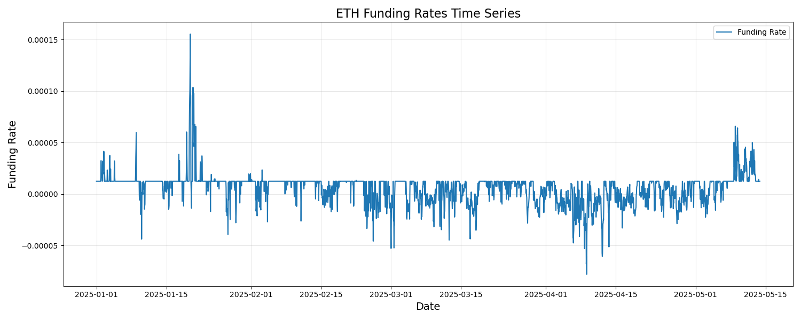
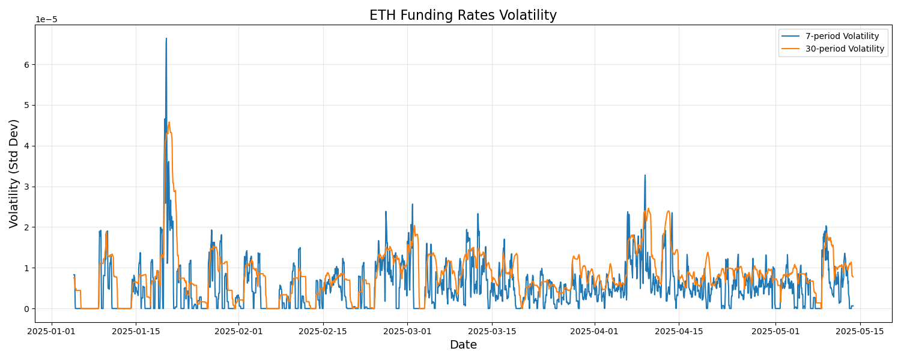
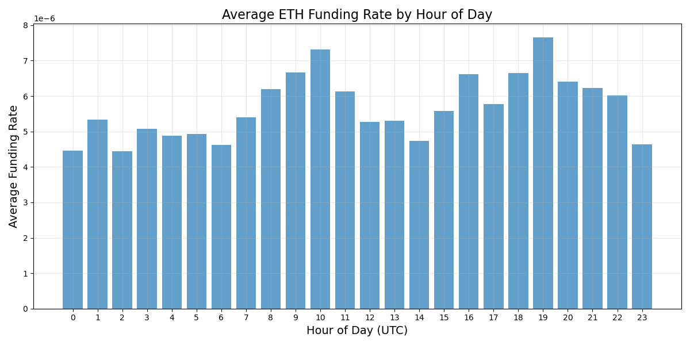
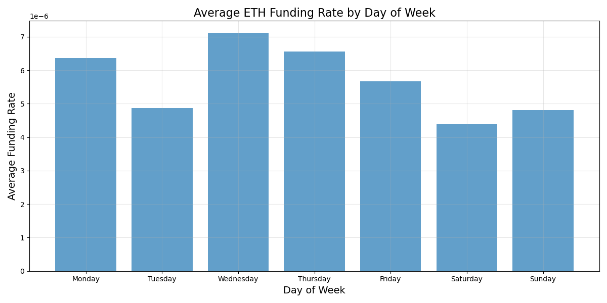

# ETH Funding Rate Analysis Summary

## Overview
This document summarizes the analysis of Ethereum funding rates from January 1, 2025, to May 13, 2025. The analysis includes basic statistical measures and time series visualizations.

## Basic Statistics

### Key Metrics
- **Mean**: 0.00000568
- **Median**: 0.00001250
- **Standard Deviation**: 0.00001428
- **Minimum**: -0.00007789
- **Maximum**: 0.00015548

### Distribution
- **Positive Rates**: 71.21%
- **Negative Rates**: 28.79%
- **Zero Rates**: 0.00%

The data shows that ETH funding rates are predominantly positive during the analyzed period, with a positive skew in the distribution. The median (0.00001250) being higher than the mean (0.00000568) suggests that there are some negative outliers pulling the mean down.

## Time Series Analysis

### Patterns and Trends
1. **Moving Averages**: The 7-period, 30-period, and 90-period moving averages show the smoothed trends in the funding rates.
2. **Volatility**: The 7-period and 30-period volatility measures highlight periods of increased uncertainty in the market.
3. **Daily Patterns**: Analysis of funding rates by hour of day reveals intraday patterns in the funding rates.
4. **Weekly Patterns**: Analysis of funding rates by day of week shows which days tend to have higher or lower funding rates.

## Conclusions

1. **Market Sentiment**: The predominantly positive funding rates (71.21%) suggest a bullish sentiment for ETH during the analyzed period.
2. **Seasonality**: The analysis revealed daily and weekly patterns in funding rates, which could be useful for traders to time their entries and exits.
3. **Volatility Clusters**: The volatility analysis showed periods of higher uncertainty, which could indicate market regime changes.

## Recommendations

1. **Trading Strategy**: Consider the daily and weekly patterns identified to optimize entry and exit points.
2. **Risk Management**: Be aware of the periods with higher volatility and adjust position sizes accordingly.
3. **Further Analysis**: Explore the relationship between funding rates and ETH price movements to develop more comprehensive trading strategies.

## Visualizations

### Time Series Plot

### Moving Averages Plot

### Volatility Plot

### Histogram of Funding Rates

### Daily Pattern Plot

### Weekly Pattern Plot
 