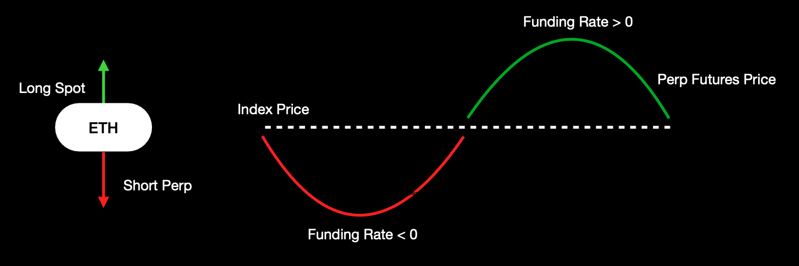
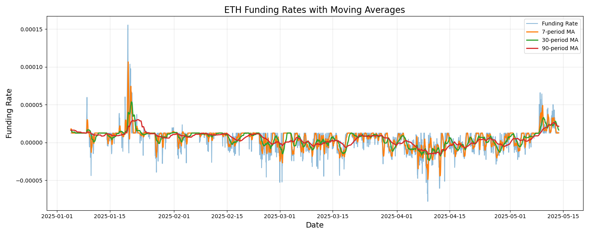
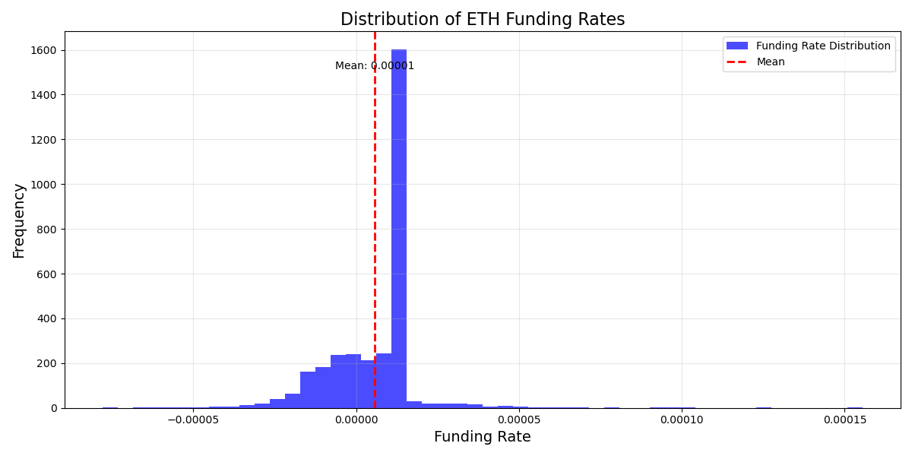

# The modification of the basis-trading between spot and perpetuals

## Authors: Pudovikov Andrey & Bolotin Danila

# Introduction

This section describes the classic basis-trading between spot and perpetuals in the Decentralized Finance

### Definitions

Basis trading is a sophisticated trading strategy that leverages the unique characteristics of perpetual futures contracts in decentralized cryptocurrency markets. To comprehend this strategy, we must first understand two key concepts: perpetual contracts and funding rates.

**Perpetual contracts** are derivative instruments that allow traders to take long or short positions on an asset without an expiration date. Unlike traditional futures contracts, perpetual contracts can be held indefinitely, with a mechanism to keep the contract price closely aligned with the spot market price.

**The funding rate** is a critical component of perpetual contracts that ensures the contract price remains close to the spot market price. Periodically (typically every 8 hours), traders holding long or short positions pay or receive a funding rate:

- *Positive Funding Rate*: Long position holders pay short position holders
- *Negative Funding Rate*: Short position holders pay long position holders

### Basis Trading Strategy

The basic basis trading strategy involves exploiting the price discrepancies between spot and perpetual markets:

1. *Spot Market Position*: Take a position in the underlying asset
2. *Perpetual Contract Position*: Take an opposite position in the perpetual contract
3. *Profit from Funding Rates*

### Simple Trading Approach
As funding rates are consistently positive, traders might:
   - Go long in the spot market
   - Simultaneously open a short position in perpetual contracts




This strategy aims to capture the funding rate payments while maintaining a market-neutral position.


# The proposed modification

## The first idea

**Disadantage of the classic method:** investor must pay during negative funding rates.

Possible solution - close position or even, open new positions to farm funding rates.

Is it a good idea? Dive into the statistics of the funding rate for ETH on the Hyperliquid!

See more in the corresponding [file](funding_rate_analysis/eth_funding_rates_analysis.md).

This report will examine funding rates from January 1, 2025, to May 13, 2025.




Distribution:
- Positive Rates: 71.21%
- Negative Rates: 28.79%



Thus, it seems to be a good idea!

## The second idea

**Disadvantage:** investor does not know hwo long the funding rate will be negative - maybe he will lose more money on fees by this trade.

Possible solution - use ML or DL techniques for the funding rate prediction. 

To solve this problem we tested two giants of the timeseries forecasting - [Prophet library](https://facebook.github.io/prophet/docs/quick_start.html#python-api) and [Long Short-Term Memory (LSTM) model](https://en.wikipedia.org/wiki/Long_short-term_memory)

See [forecasting file](funding_rate_analysis/eth_funding_rate_sign_prediction_report.md).

## Overall method:


The whole algorithm will look like:

```
Procedure: AdaptiveFundingRateStrategy(N, model, r_cur)

1. Predict funding rate for the next N hours
    r_pred = model.predict(N)

2. Compare the signs of the r_cur and r_pred

   - If r_pred * r_cur > 0:
    * Stay in the same position

   - Else:
      - If r_pred < 0 and r_cur >0: 
        * Close long spot positions
        * Close short positions in perpetuals
        * Possible (open position for farming rate - open short spot and long perpetual)
     
      - If r_pred > 0 and r_cur < 0:
        * Possible (close position for farming rate - close short spot and long perpetual)
        * Open long spot positions
        * Open short positions in perpetuals

3. Return updated portfolio
```

## Further discussion

Note, that the proposed algo mainly depends on the signs of the rates, not even on the exact values. So, it is equal to estimate only sign of the rate.

This strategy does not include fee or gas prices. Therefore this section will discuss how to incorporate them into this strategy.

*More details*: the algorithm will be tested on the [Hyperliquid DEX](https://hyperfoundation.org/).

The Hyperliquid DEX does not have any gas prices for the trading: "Trading on Hyperliquid does not cost gas" [link](https://hyperliquid.gitbook.io/hyperliquid-docs/onboarding/how-to-start-trading).

On the other hand, there are fees for the total volume of weighted rolling trading for 14 days which depends on the total volume and the Staking tiers. [link](https://hyperliquid.gitbook.io/hyperliquid-docs/trading/fees).


There will be different options for the algorithm:

1. If the total fees $2 \cdot (\text{fee}) \cdot (\text{capital})$ of withdraw is bigger than expected win for the $N$ hours - stay at the previous strategy

2. Elif the total fees $2 \cdot 2 \cdot (\text{fee}) \cdot (\text{capital})$ of withdraw and open the new position is lower than expected win for the $N$ hours - change the strategy for new sign of the funding rate

3. Else - go out to cash

Two times - because we will have to go back to the position.

This fees are fixed, meaning that we can incorporate them in our Ml or DL models as we can work only with signs. So models will study not even the sign, but the equation - bigger or lower two and four times of certain fees. Concluding that we have a *classification* problem on time series instead of regression.

**Growth** points:

- Of course, there is a limitation of the predicion - ML and DL models usually do not provide an uncertainty interval for their prediction

- We focus only on the $N$ hour prediction not on the whole timeseries prediction, which is also possible. 
 
- This solution interacts with the funding rate, whereas it is a function and has a [formula](https://hyperliquid.gitbook.io/hyperliquid-docs/trading/funding). So, it is possible to predict them and next use this formula.

- More complex DL techniques

- Retrain or further train on new data during the time


